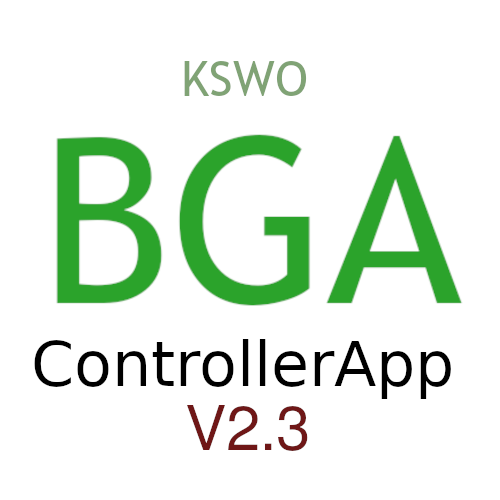

    
    <h1>BiogasControllerApp</h1>

    
    
    
    
    
     
    
    
    
    
    
     
    
    
    
    
    

				
***LOOKING FOR A MacOS BUILD MAINTAINER! You may follow the official build instructions on the kivy.org website. All other materials should already be included in this repository***
		
## FEATURES
- Easily read out the data the Microcontroller used in ENATECH sends
- Easily change the coefficients for the temperature sonds
- Easily change the temperature that is set for the controller to heat to
- Easy to navigate menus and submenus for better organisation
- (Almost) Bugfree
- Detailed and still private logging (not sending any information to anybody except you do)
- The app is still maintained and as such known issues will be resolved
- Highly detailed error resolving instructions directly inside the app 
- Easy to run: No extra Software required (e.g. Python or similar) (currently Windows only)
- Easy to install and uninstall as it has an installer and uninstaller
- Some settings are available through the /config/settings.ini file
	
# Issues
If you encounter any bugs or other weird behaviour, please open an issue on this GitHub repository. 

# Documentation
You may find documentation for this project in its wiki here on GitHub.

# Officially Supported OS
- Microsoft Windows 10, 11 (through my installer, may though support older Versions but this is not verified. Open an issue if you have managed to run it on an older version of Windows)
- Microsoft Windows XP, Vista, 7, 8, 10, 11 (through running the package with Python yourself)
- MacOS 10.9 (Mavericks) or later (required by Python)
- GNU/Linux: All distros that support Python 3.8 or later
- FreeBSD: Works with slight modification of the source code 

## Dependencies
Only needed if you run with python directly
- Python 3.8 - 3.10 (only tested on these versions)
- kivy
- pyserial

# Contributing
If you wish to contribute to this project, please fork this repository, create a new branch in your fork, make your changes and open a pull request in this repo. 
